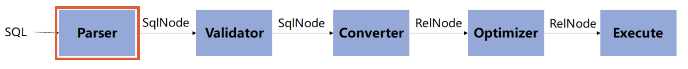
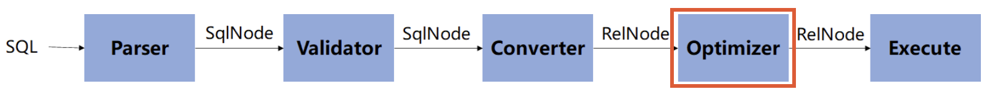

> **Apache Calcite原理与实践：https://liebing.org.cn/collections/calcite/#%E7%9B%AE%E5%BD%95**
>
> **关系代数：https://blog.csdn.net/qq_45978890/article/details/114139520**

[TOC]

[Apache Calcite](https://calcite.apache.org/docs/)是一个动态的数据管理框架, 它可以**实现SQL的解析、验证、优化和执行**。

称之为”动态”是因为**Calcite是模块化和插件式的,** 上述任何一个步骤在Calcite中都对应着一个相对独立的模块。用户可以选择使用其中的

一个或多个模块, 也**可以对任意模块进行定制化的扩展**。这种灵活性使得Calcite可以在现有的存储或计算系统上方便地**构建SQL访问层**，

甚至在已有SQL能力的系统中也可引入Calcite中的某个模块实现相应的功能, 比如Apche Hive就仅使用了Calcite进行优化, 但却有自己的

SQL解析器。 

[Apache Flink](https://flink.apache.org/), [Apache Drill](https://drill.apache.org/)等都大量使用了Calcite, 因此理解Calcite的原理已经成为理解大数据系统中SQL访问层实现原理的必备条件。

Calcite的目的是**仅提供构建SQL访问的框架**，省略了一些关键的组成部分（数据的存储, 处理数据的算法和存储元数据的存储库）。

**使用Calcite可以十分方便地构建联邦查询引擎, 即屏蔽底层物理存储和计算引擎, 使用一个统一的SQL接口实现数据访问。**

## 1 Calcite整体处理流程

## 2 准备SQL

~~~sql
# users表
id:string,name:string,age:int
1,Jack,28
2,John,21
3,Tom,32
4,Peter,24

# orders表
id:string,user_id:string,goods:string,price:double
001,1,Cola,3.5
002,1,Hat,38.9
003,2,Shoes,199.9
004,3,Book,39.9
005,4,Phone,2499.9

# SQL语句: 查询每个用户的订单消费总额, 并按用户id排序后输出.
SELECT u.id, name, age, sum(price)
FROM users AS u join orders AS o ON u.id = o.user_id
WHERE age >= 20 AND age <= 30
GROUP BY u.id, name, age
ORDER BY u.id
~~~

## 3 SQL解析：SQL -> SqlNode AST树

**通过词法分析和语法分析将SQL字符串转化为AST，即转成了SqlNode。**

**在Calcite中, `SqlNode`是AST节点的抽象基类, 不同类型的节点有对应的实现类，比如上述SQL语句便会生成`SqlSelect`和`SqlOrderBy`两个主要的节点：**

~~~java
String sql = "SELECT u.id, name, age, sum(price) " +
    "FROM users AS u join orders AS o ON u.id = o.user_id " +
    "WHERE age >= 20 AND age <= 30 " +
    "GROUP BY u.id, name, age " +
    "ORDER BY u.id";
// 创建SqlParser, 用于解析SQL字符串
SqlParser parser = SqlParser.create(sql, SqlParser.Config.DEFAULT);
// 解析SQL字符串, 生成SqlNode树，sqlNode是AST的根节点
SqlNode sqlNode = parser.parseStmt();
~~~

- **Flink 中的SqlNode**

## 4 SQL验证：SqlNode树 -> SqlNode树（内部结构发生变化）

SQL解析阶段只是简单地将SQL字符串转化为`SqlNode`树, 并没有对SQL语句进行语义上的检查, 比如SQL中指定的表是否存在于数据库中, 字段是否存在于表中等。Calcite中的SQL验证阶段一方面会借助元数据信息执行上述验证, 另一方面会对`SqlNode`树进行一些改写, 以转化为统一的格式, 方便下一步处理。

~~~java
// 创建CatalogReader, 用于指示如何读取Schema信息
Prepare.CatalogReader catalogReader = new CalciteCatalogReader(
    rootSchema,
    Collections.singletonList(schema.getSchemaName()),
    typeFactory,
    config);
// 创建SqlValidator, 用于执行SQL验证
SqlValidator.Config validatorConfig = SqlValidator.Config.DEFAULT
    .withLenientOperatorLookup(config.lenientOperatorLookup())
    .withSqlConformance(config.conformance())
    .withDefaultNullCollation(config.defaultNullCollation())
    .withIdentifierExpansion(true);
SqlValidator validator = SqlValidatorUtil.newValidator(
    SqlStdOperatorTable.instance(), catalogReader, typeFactory, validatorConfig);
// 执行SQL验证
SqlNode validateSqlNode = validator.validate(node);
~~~

SQL验证后的输出结果仍是`SqlNode`树, 不过其内部结构发生了改变. 一个明显的变化是验证后的`SqlOrderBy`节点被改写为了`SqlSelect`节点, 并在其`orderBy`变量中记录了排序字段。

Calcite在验证时会为每个字段加上表名限定, 为每个表加上Schema限定

~~~sql
-- 验证前的SqlNode树打印结果
SELECT `u`.`id`, `name`, `age`, SUM(`price`)
FROM `users` AS `u`
INNER JOIN `orders` AS `o` ON `u`.`id` = `o`.`user_id`
WHERE `age` >= 20 AND `age` <= 30
GROUP BY `u`.`id`, `name`, `age`
ORDER BY `u`.`id`

-- 验证后的SqlNode树打印结果
SELECT `u`.`id`, `u`.`name`, `u`.`age`, SUM(`o`.`price`)
FROM `s`.`users` AS `u`
INNER JOIN `s`.`orders` AS `o` ON `u`.`id` = `o`.`user_id`
WHERE `u`.`age` >= 20 AND `u`.`age` <= 30
GROUP BY `u`.`id`, `u`.`name`, `u`.`age`
ORDER BY `u`.`id`
~~~

## 5 转为关系代数：SqlNode树 -> RelNode树

**在Calcite中, 关系代数由`RelNode`表示**

~~~java
// 创建VolcanoPlanner, VolcanoPlanner在后面的优化中还需要用到
VolcanoPlanner planner = new VolcanoPlanner(RelOptCostImpl.FACTORY, Contexts.of(config));
planner.addRelTraitDef(ConventionTraitDef.INSTANCE);
// 创建SqlToRelConverter
RelOptCluster cluster = RelOptCluster.create(planner, new RexBuilder(typeFactory));
SqlToRelConverter.Config converterConfig = SqlToRelConverter.config()
    .withTrimUnusedFields(true)
    .withExpand(false);
SqlToRelConverter converter = new SqlToRelConverter(
    null,
    validator,
    catalogReader,
    cluster,
    StandardConvertletTable.INSTANCE,
    converterConfig);
// 将SqlNode树转化为RelNode树
RelNode relNode = converter.convertQuery(validateSqlNode, false, true);
~~~

**`RelNode`树其实可以理解为一个逻辑执行计划, 上述SQL对应的逻辑执行计划如下, 其中每一行都表示一个节点, 是`RelNode`的实现类, 缩进表示父子关系：**

~~~txt
LogicalSort(sort0=[$0], dir0=[ASC])
  LogicalAggregate(group=[{0, 1, 2}], EXPR$3=[SUM($3)])
    LogicalProject(id=[$0], name=[$1], age=[$2], price=[$6])
      LogicalFilter(condition=[AND(>=($2, 20), <=($2, 30))])
        LogicalJoin(condition=[=($0, $4)], joinType=[inner])
          LogicalTableScan(table=[[s, users]])
          LogicalTableScan(table=[[s, orders]])
~~~

## 6 查询优化：RelNode树 -> RelNode树

查询优化是Calcite的核心模块, 它主要有三部分组成:

- **Planner rules:** 即优化规则, Calcite已经内置了很多优化规则, 如谓词下推, 投影下推等. 用户也可定义自己的优化规则.
- **Metadata providers:** 这里的元数据主要用于基于成本的优化(Cost-based Optimize, CBO)中, 包括表的行数, 表的大小, 给定列的值是否唯一等信息.
- **Planner engines:** Calcite提供了两种优化器实现, `HepPlanner`用于实现基于规则的优化(Rule-based Optimize, RBO), `VolcanoPlanner`用于实现基于成本的优化.

本文中暂且只使用`VolcanoPlanner`, 执行优化的代码如下. `EnumerableRules`中的规则用于将逻辑计划中的节点转化为对应的`EnumerableRel`节点, 它是Calcite中提供的物理节点, 可用于生成执行代码:

~~~java
// 优化规则
RuleSet rules = RuleSets.ofList(
    CoreRules.FILTER_TO_CALC,
    CoreRules.PROJECT_TO_CALC,
    CoreRules.FILTER_CALC_MERGE,
    CoreRules.PROJECT_CALC_MERGE,
    CoreRules.FILTER_INTO_JOIN,		// 过滤谓词下推到Join之前
    EnumerableRules.ENUMERABLE_TABLE_SCAN_RULE,
    EnumerableRules.ENUMERABLE_PROJECT_TO_CALC_RULE,
    EnumerableRules.ENUMERABLE_FILTER_TO_CALC_RULE,
    EnumerableRules.ENUMERABLE_JOIN_RULE,
    EnumerableRules.ENUMERABLE_SORT_RULE,
    EnumerableRules.ENUMERABLE_CALC_RULE,
    EnumerableRules.ENUMERABLE_AGGREGATE_RULE);
Program program = Programs.of(RuleSets.ofList(rules));
RelNode optimizerRelTree = program.run(
    planner,
    relNode,
    relNode.getTraitSet().plus(EnumerableConvention.INSTANCE),
    Collections.emptyList(),
    Collections.emptyList());
~~~

经过优化后的输出如下, 可以看到所有的节点都变成了`Enumerable`开头的物理节点, 它们的基类是`EnumerableRel`，EnumerableRel是RelNode的子类

~~~txt
EnumerableSort(sort0=[$0], dir0=[ASC])
  EnumerableAggregate(group=[{0, 1, 2}], EXPR$3=[SUM($3)])
    EnumerableCalc(expr#0..6=[{inputs}], proj#0..2=[{exprs}], price=[$t6])
      EnumerableHashJoin(condition=[=($0, $4)], joinType=[inner])
        EnumerableCalc(expr#0..2=[{inputs}], expr#3=[Sarg[[20..30]]], expr#4=[SEARCH($t2, $t3)], proj#0..2=[{exprs}], $condition=[$t4])
          EnumerableTableScan(table=[[s, users]])
        EnumerableTableScan(table=[[s, orders]])
~~~

## 7 生成执行计划：计算处理

~~~java
EnumerableRel enumerable = (EnumerableRel) optimizerRelTree;
Map<String, Object> internalParameters = new LinkedHashMap<>();
EnumerableRel.Prefer prefer = EnumerableRel.Prefer.ARRAY;
Bindable bindable = EnumerableInterpretable.toBindable(internalParameters,
                                                       null, enumerable, prefer);
Enumerable bind = bindable.bind(new SimpleDataContext(rootSchema.plus()));
Enumerator enumerator = bind.enumerator();
while (enumerator.moveNext()) {
    Object current = enumerator.current();
    Object[] values = (Object[]) current;
    StringBuilder sb = new StringBuilder();
    for (Object v : values) {
        sb.append(v).append(",");
    }
    sb.setLength(sb.length() - 1);
    System.out.println(sb);
}
~~~
