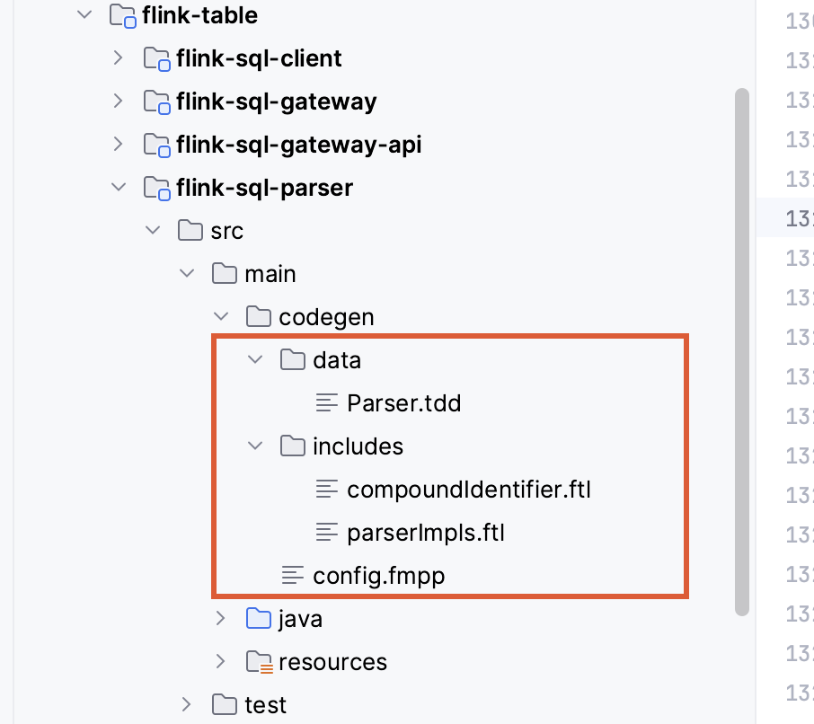

> 参考：https://liebing.org.cn/apache-calcite-sql-parser.html

## 1 SQL解析器构建

**Flink源码中，Parser.jj文件生成的源文件：**

**通过Javacc将Parser.jj生成SQL解析器的java代码：**

## 2 SqlNode结构

**在Calcite中, 把SQL解析后的结果称为解析树(Parse tree), 实际上就是我们之前说过的`SqlNode`树**

**SqlNode 可以理解为是SQL的token的单个或多个组合， 这里的token是指SQL语句中的最小组成部分，比如 select * from t; token 指 select, *, from 等**

**SqlNode的子类如下：**

举例说明：

~~~SQL
CREATE TABLE t (
  ca INT,
  cb DOUBLE,
  cc VARCHAR
);

SELECT ca, cb, cc FROM t WHERE ca = 10;
~~~

- **`SqlIdentifier`代表标识符：**上述`SELECT`语句中`ca`, `cb`, `cc`以及`t`在解析树中都是一个`SqlIdentifier`实例.
- **`SqlLiteral`代表常量：**上述`SELECT`语句中`10`在解析树中就是一个`SqlLiteral`实例, 它的具体实现类是`SqlNumericLiteral`, 表示数字常量.
- **`SqlNodeList`表示`SqlNode`列表：**上述`SELECT`语句中`ca`, `cb`, `cc`会共同组成一个`SqlNodeList`实例.
- **`SqlCall`是对`SqlOperator`的调用：** (`SqlOperator`可以用来描述任何语法结构, 所以实际上SQL解析树中的每个非叶节点都是某种`SqlCall`). 上述整个`SELECT`语句就是一个`SqlCall`实例, 它的具体实现类是`SqlSelect`.
- **`SqlDataTypeSpec`表示解析树中的SQL数据类型：** 上述`CREATE`语句中的`INT`, `DOUBLE`, `VARCHAR`在解析树中都是一个`SqlDataTypeSpec`实例.
- **`SqlIntervalQualifier`代表时间间隔限定符：**比如SQL中的`INTERVAL '1:23:45.678' HOUR TO SECOND`在解析树中就是一个`SqlIntervalQualifier`实例
- **`SqlDynamicParam`表示SQL语句中的动态参数标记**

### 2.1 SqlLiteral（SQL常量）

**SqlLiteral**的每种实现类就代表了一种特定的**常量类型**：数字、字符串、时间、时间间隔

### 2.2 SqlCall

SqlCall常见的子类如下：

- **`SqlSelect`表示整个`SELECT`语句的解析结果：**内部有`from`, `where`, `group by`等成员变量保存对应字句内的解析结果.
- **`SqlOrderBy`表示带有`ORDER BY`的`SELECT`语句的解析结果**
- **`SqlInsert`和`SqlDelete`分别代表`INSERT`和`DELETE`语句的解析结果**
- **`SqlJoin`表示`JOIN`子句的解析结果**
- **`SqlBasicCall`表示一个基本的计算单元：**持有操作符和操作数, 如`WHERE`子句中的一个谓词表达式就会被解析为`SqlBasicCall`
- **`SqlDdl`是DDL语句解析结果的基类：**以`CREATE TABLE`语句为例, 它就会被解析成`SqlCreateTable`实例

**SqlCall是对SqlOperator的调用，SqlOperator是SqlCall的组成部分**

### 2.3 SqlOperator

SqlOperator常见子类如下：

**`SqlOperator`其实可以表达SQL语句中的任意运算：**它包括**函数**、**操作符(如`=`)**和**语法结构(如`case`语句)**

- **`SqlFunction`表示SQL语句中的函数调用：** 如`SqlCastFunction`表示`cast`函数；在解析阶段所有自定义函数都会被表示为`SqlUnresolvedFunction`, 在验证阶段才会转化为对应的`SqlUserDefinedFunction`.
- **`SqlSelectOperator`表示整个`SELECT`查询语句**.
- **`SqlBinaryOperator`表示二元运算：**如`WHERE`子句中的`=`运算.

### 2.4 案例

**SQL语句：**

~~~SQL
insert into print_table select id,name,age from source_table where id>100 and UPPER(name)='test';
~~~

**生成的parse tree如下，可以看到parse tree的节点为SqlNode类型，SqlOperater表示各种运算**

### 3 SQL解析流程

~~~java
SqlParser.Config config = SqlParser.config()
    .withParserFactory(SqlParserImpl.FACTORY);
SqlParser parser = SqlParser.create(sql, config);
SqlNode sqlNode = parser.parseStmt();
~~~

SQL语句 转 AST抽象语法树

- 在线转换链接

https://astexplorer.net/

- Flink 中的SqlNode

