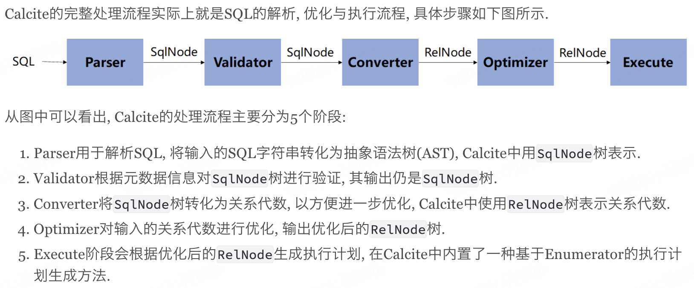

> **参考链接：https://liebing.org.cn/collections/calcite/#%E7%9B%AE%E5%BD%95**

### 1 Apache Calcite整体架构及处理流程

[Apache Calcite](https://calcite.apache.org/docs/)是一个动态的数据管理框架, 它可以实现SQL的解析, 验证, 优化和执行. 称之为”动态”是因为Calcite是模块化和插件式的, 上述任何一个步骤在Calcite中都对应着一个相对独立的模块. 用户可以选择使用其中的一个或多个模块, 也可以对任意模块进行定制化的扩展. 正是这种灵活性使得Calcite可以在现有的存储或计算系统上方便地构建SQL访问层, 甚至在已有SQL能力的系统中也可引入Calcite中的某个模块实现相应的功能, 比如Apche Hive就仅使用了Calcite进行优化, 但却有自己的SQL解析器. Calcite的这种特性使其在大数据系统中得到了广泛的运用, 比如[Apache Flink](https://flink.apache.org/), [Apache Drill](https://drill.apache.org/)等都大量使用了Calcite, 因此理解Calcite的原理已经成为理解大数据系统中SQL访问层实现原理的必备条件。

Calcite的目的是仅提供构建SQL访问的框架，省略了一些关键的组成部分, 例如, 数据的存储, 处理数据的算法和存储元数据的存储库。

#### Calcite处理流程

Flink SQL中，通过Parser.jj生成SQL解析器代码

SQL语句 转 AST抽象语法树

- 在线转换链接

https://astexplorer.net/

- Flink 中的SqlNode

