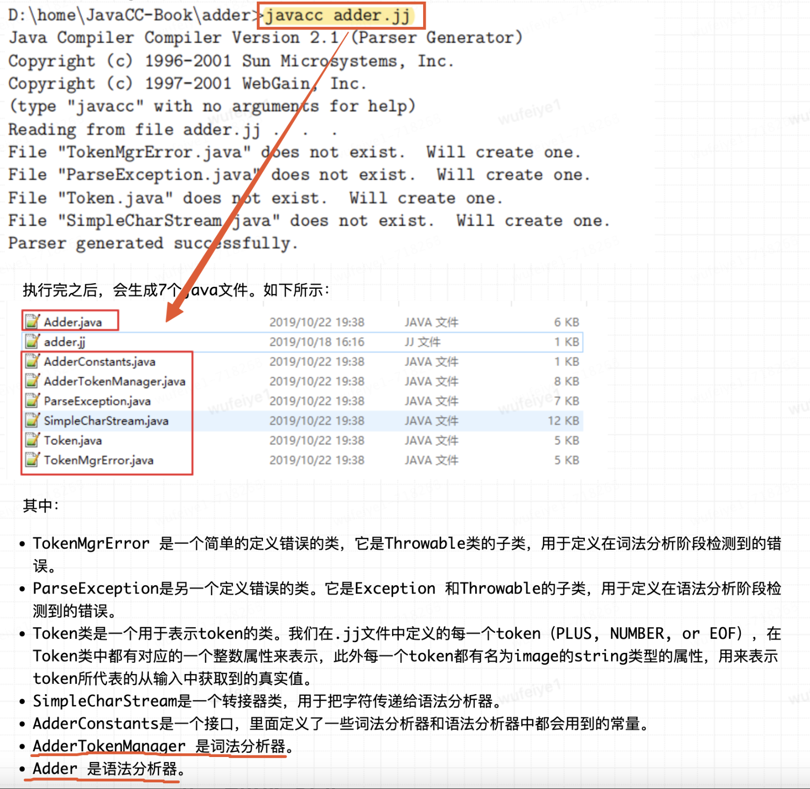

> 参考链接：
>
> JavaCC解析表达式并生成抽象语法树：https://liebing.org.cn/javacc-expression-ast.html
>
> JavaCC入门指南：https://www.cnblogs.com/suhaha/p/11733487.html
>
> JavaCC入门案例：https://www.cnblogs.com/suhaha/p/11733528.html

[TOC]

## 1 JavaCC功能简介

JavaCC全称为Java Compiler Compiler，它是一个生成器，用于生成词法分析器（lexical analysers）和语法分析器（parsers）。它可以通过读取一个词法和语法描述文件（即词法和语法描述是写在同一个文件中的），来生成一个java程序，这个java程序就包括了词法分析器和语法分析器。接着就可以用生成的词法分析器和语法分析器来对我们的输入进行判断，判断输入是否符合我们所要求的语法规则。

**JavaCC本身并不是词法分析器和语法分析器，它是一个生成器！JavaCC通过读取一个后缀为.jj的描述文件中的特定描述，来生成词法分析器和语法分析器，并且生成的词法分析器和语法分析器使用Java书写的**

- 词法分析器可以将一个字符序列拆分为一个个的token
- 经过词法分析而得到的tokens序列，在之后将会被传给语法分析器进行语法判

## 2 JavaCC语法文件解析

### 2.1 .jj文件内容

~~~jj
options {
    JavaCC 的选项
}

PARSER_BEGIN(解析器类名)
package 包名;
import 库名;

public class 解析器类名 {
    任意的 Java 代码
}
PARSER_END(解析器类名)

扫描器的描述（词法分析）

解析器的描述（语法分析）
~~~

结构分为如下：

- **options块：**可以省略（如STATIC = false，使得生成的函数不是static）
- **PARSER_BEGIN(解析器类名)……PARSER_END(解析器类名)块：**表示一个Java类, 可以支持任何Java语法, 这里定义的类成员变量或方法也能在解析器描述的actions中使用。JavaCC还会根据.jj描述文件的其他部分的描述，来生成解释器类的其他声明信息。
- 扫描器描述和解析器描述

### 2.2 .jj文件-扫描器的描述部分（词法分析）

扫描器的描述（词法分析）举例

~~~jj
SKIP : { " "}                          // 定义会被词法分析器忽略的部分：空格。被忽略掉意味着，它们将不会被传给语法分析器
SKIP : { "\n" | "\r" | "\r\n" }        // 定义会被忽略的部分：换行符，|表示或的意思
TOKEN : { < PLUS : "+" > }             // 定义一个名为PLUS的token，用它来表示加号"+"
TOKEN : { < NUMBER : (["0"-"9"])+ > }  // 定义一个名为NUMBET的token，用它来表示([”0”-”9”])+，正则表达式，即所有的正整数序列
~~~

补充：词法分析器中还可以生成一种token，这种token用EOF表示，用来代表输入序列的末尾，不需要显示定义

~~~jj
“123 + 456\n”
词法分析器将解析的7个token：NUMBER、空格、PLUS、空格、NUMBER、换行符、EOF
标记为SKIP的token将不会被往下传递给语法分析器
词法分析器在分析完成之后，传递给语法分析器的token序列：NUMBER, PLUS, NUMBER, EOF

“123 ++ 456\n”
传递给语法分析器的token序列：NUMBER, PLUS, PLUS, NUMBER, EOF
语法分析器分析到第二个PLUS token的时候，会检测到错误，并停止从词法分析器请求tokens
所以，实际上真正传递给语法分析器的tokens序列只有NUMBER, PLUS, PLUS。
~~~

### 2.3 .jj文件-解析器的描述部分（语法分析）

~~~jj
void Start() :
{}
{
    <NUMBER>         // 以NUMBER token开头
    (
        <PLUS>
        <NUMBER>
    )*               // 在NUMBER和EOF中间，可以是0至多个PLUS和NUMBER的token，且必须是PLUS后跟着NUMBER
    <EOF>            // 以EOF token结尾
}
~~~

**补充：解析器的描述支持扩展巴科斯范式(Extended Backus–Naur Form, EBNF)，可以在适当位置嵌入任意Java代码，使用`Adder`类所定义的成员变量或方法**

~~~jj
long expr():
{
  Token x, y;
}
{
  x=<INTEGER> "+" y=<INTEGER> <EOF>
  // action
  {
    return Long.parseLong(x.image) + Long.parseLong(y.image);
  }
}

// expr()：会生成为解释器类中的一个同名方法
// expr()之后的{}：定义任何临时变量, 这里的Token是JavaCC预定义的表示Token的类
// 之后的{}：定义方法体, 可随时嵌入{}并在里面编写Java代码, 这在JavaCC中称为action
// 比如在expr()中, 在解析到<INTEGER> "+" <INTEGER> <EOF>之后就会执行之后action中的代码。这里只是简单的将对于的字符转换为整数相加后范围, 如果有需要也可以在action中添加生成抽象语法树的逻辑。在EBNF中可以将任何元素赋值给临时变量。
~~~

其他例子：这里没有加action代码

~~~jj
void expr(): { }
{
    term() ("+" expr() | "-" expr())*		// term开头, 后面可能有+expr或-expr, 也可能没有
}

void term(): { }
{
    primary() ("*" term() | "/" term())*	// primary开头, 后面可能有*term或/term, 也可能没有
}

void primary(): { }
{
    <NUMBER>							// 数字, 如123, 789.98
|   LOOKAHEAD(<NUMBER> "!")				// 数字的阶乘, 如3!, 5!
    <NUMBER> "!"
|   LOOKAHEAD("(" expr() ")" "!")		// 表达式的阶乘, 如(3+2*3)!
    "(" expr() ")" "!"				
|   "+" primary()						// "+"号前缀, 如+3, +(3+3*2)
|   "-" primary()						// "-"号前缀, 如-3, -(3+3*2)
|   "(" expr() ")"						// 括号包围的表达式, 如(3+3*2)
|   <SIN> "(" expr() ")"				// sin运算, 如sin(3), sin(3+3*4)
|   <COS> "(" expr() ")"				// cos运算, 如cos(3), cos(3+3*4)
|   <TAN> "(" n=expr() ")"				// tan运算, 如tan(3), tan(3+3*4)
}
~~~

### 2.4 完整的jj文件及解析流程

**扫描器读取输入字符串并转换成Token序列，传递给解析器，解析器按照解析器的描述规则，进行语法校验**

~~~jj
/* adder.jj Adding up numbers */
options {
    STATIC = false ;
    }

// 解析器代码，类名为Adder
PARSER_BEGIN(Adder)
    class Adder {
        public static void main( String[] args ) throws ParseException, TokenMgrError {
            Adder parser = new Adder( System.in );
            parser.Start();
        }
    }
PARSER_END(Adder)

// 扫描器描述
SKIP : { " "}
SKIP : { "\n" | "\r" | "\r\n" }
TOKEN : { < PLUS : "+" > }
TOKEN : { < NUMBER : (["0"-"9"])+ > }

// 解析器描述
void Start() :
{}
{
    <NUMBER>
    (
        <PLUS>
        <NUMBER>
    )*
    <EOF>
}
~~~

## 3 抽象语法树

### 3.1 构建抽象语法树

- 有了词法描述和语法描述就可以实现表达式的解析了, 但也仅仅是解析, 除了检查输入的表达式在语法上是否合规并没有其他任何作用。
- 要实现表达式的计算就需要在解析器语法描述的适当位置加入action

**抽象语法树构建方案：在action中添加生成抽象语法树的代码, 从而将表达式转化为抽象语法树, 然后在使用Visitor模式遍历抽象语法树计算结果**

- SQL转抽象语法树的可视化在线链接：https://astexplorer.net/

- **在jj文件中定义解析器，调用parse()方法最终会生成抽象语法树，Node为抽象语法树节点，调用parse()方法返回的是抽象语法树的根节点**

### 3.2 遍历抽象语法树

生成抽象语法树, 相当于利用JavaCC将无结构的表达式字符串转化为了内存中结构化的树，完成了抽象语法树的生成，JavaCC的任务也就完成了。

之后如何通过抽象语法树计算表达式的结果就需要我们自己解决了

在编译器中, 通常会将源代码解析为抽象语法树, 然后使用**Visitor模式遍历抽象语法树**进行**语义分析**，如**引用消解、静态类型检查等**

**Visitor模式有一个抽象接口, 定义了对各种类型的节点进行访问的方法。**比如在表达式抽象语法树的遍历中, 我们定义了如下`ASTVisitor`接口, 其中包含对各种节点的`visit`方法：

~~~java
public interface ASTVisitor<T> {
  T visit(ExprNode node);
  T visit(TermNode node);
  T visit(SinNode node);
  T visit(CosNode node);
  T visit(TanNode node);
  T visit(FactorialNode node);
  T visit(ValueNode node);
}
// 计算表达式结果的ASTVisitor实现类
public class CalculateVisitor implements ASTVisitor<Double> {

  public double calculate(Node node) {
    return node.accept(this);
  }
    
  ...

  @Override
  public Double visit(FactorialNode node) {
    double value = node.getNode().accept(this);
    double result = 1;
    for (int i = 1; i <= value; ++i) {
      result *= i;
    }
    return result * node.getSign();
  }

  @Override
  public Double visit(ValueNode node) {
    return node.getValue() * node.getSign();
  }
}
~~~

**在`Node`类中定义一个抽象方法`accept`用于实现不同场景下各个节点的遍历逻辑，针对不同场景的抽象语法树，可以传入不同的ASTVisitor实现类：**

~~~java
public abstract class Node {
  ...
      
  public abstract <T> T accept(ASTVisitor<T> visitor);
}

public class ValueNode extends Node {
  ...

  @Override
  public <T> T accept(ASTVisitor<T> visitor) {
    return visitor.visit(this);
  }
}
~~~
