> **本文参考《设计模式的艺术》—— 刘伟**

[TOC]

## 1 如何画好架构图

### 1.1 常见的架构图

TOGAF：业务、数据、应用、技术架构

RUP4+1：场景、逻辑、开发、处理、物理视图

C4：Context、Container、Componet、Code

4R：业务、系统、应用、部署、系统序列

### 1.2 常见问题

1、边界：系统内、系统外，用框框起来

2、色彩：一个架构图建议不超过3种颜色，系统外的灰色调，重点的色彩鲜艳

3、图例：缺少图例解释，图例类型不一致(比如都用一种图例)

4、图的数量：几张好？

5、缺少数据视图

6、可跟踪性：架构图版本、变更记录、更新不及时

### 1.3 画图工具

## 2 UML类图与面向对象设计原则

### 2.1、UML特性

统一（Unified）、建模（Modeling）、语言（Language）

### 2.2、类的UML图示

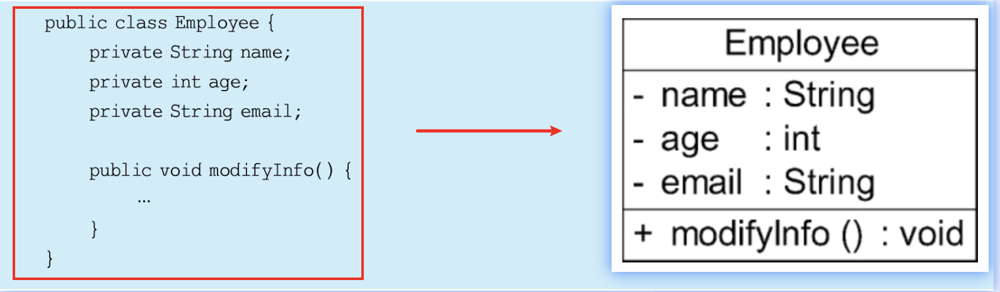

### 2.3 类之间的关系

**（1）关联关系**

关联（Association）关系是是一种结构化关系，用于表示一类对象与另一类对象之间有联系，如汽车和轮胎、师傅和徒弟、班级和学生等。

**（2）聚合关系**

聚合（Aggregation）关系表示整体与部分的关系。在聚合关系中，成员对象是整体对象的一部分，但是成员对象可以脱离整体对象独立存在。

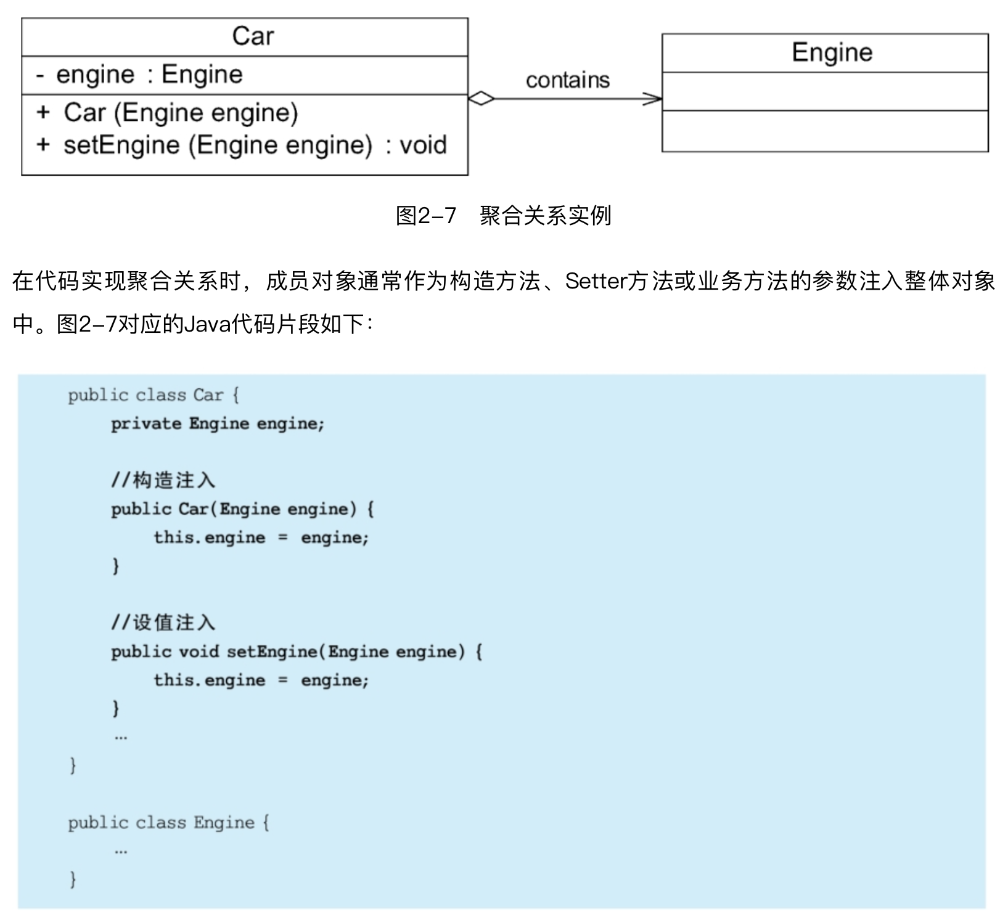

**（3）组合关系**

组合（Composition）关系也表示类之间整体和部分的关系，但是在组合关系中整体对象可以控制成员对象的生命周期。一旦整体对象不存在，成员对象也将不存在，成员对象与整体对象之间具有同生共死的关系。

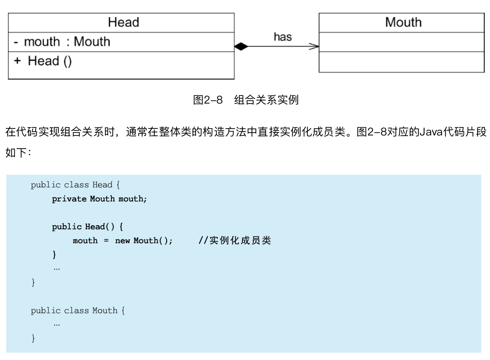

**（4）依赖关系**

依赖（Dependency）关系是一种使用关系，特定事物的改变有可能会影响到使用该事物的其他事物，在需要表示一个事物使用另一个事物时使用依赖关系。依赖关系有如下三种情况：

- A类是B类方法当中的一个参数
- A类是B类中的（某中方法的）局部变量
- A类向B类发送消息，从而影响B类发生变化

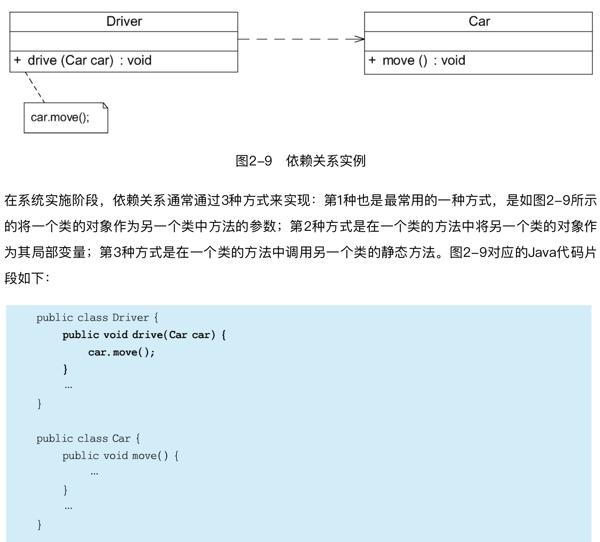

**（5）泛化关系（继承关系）**

泛化（Generalization）关系也就是继承关系，用于描述父类与子类之间的关系，父类又称作基类或超类，子类又称作派生类。

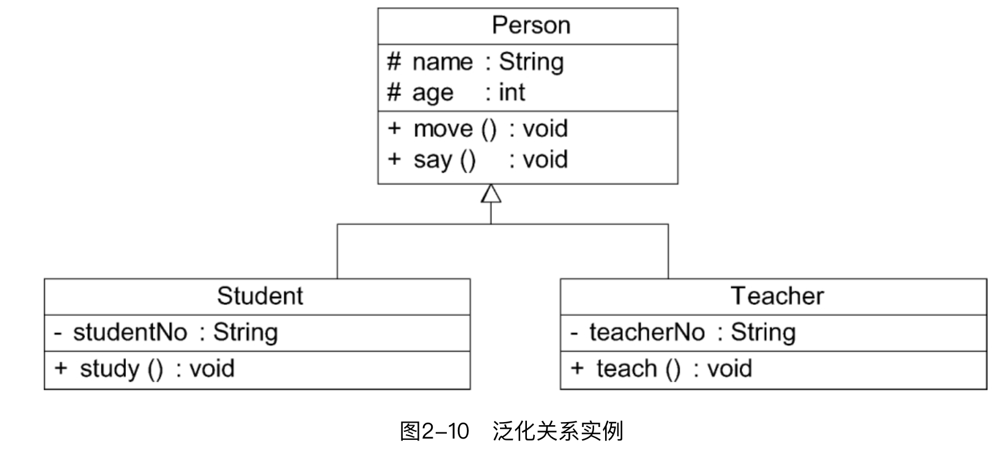

**（6）接口与实现关系**

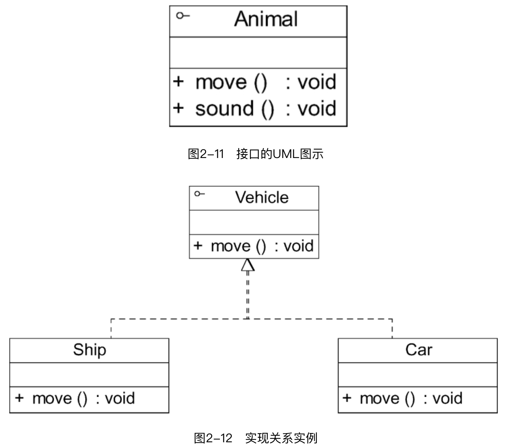

### 2.4 面向对象的设计原则 （常用SOLID）

面向对象设计原则也是用于评价一个设计模式的使用效果的重要指标之一，在之后的设计模式学习中，大家经常会看到诸如“×××模式符合×××原则”、“×××模式违反了×××原则”这样的语句。

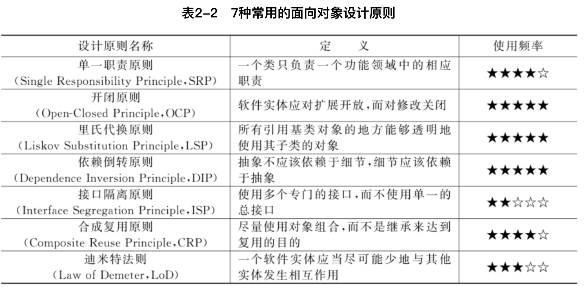

**（1）单一职责原则（Single Responsibility Principle，SRP）**

认为“对象应该仅具有一种单一功能”的概念。

单一职责原则是实现高内聚、低耦合的指导方针。就一个类而言，应该只有一个引起它变化的原因。

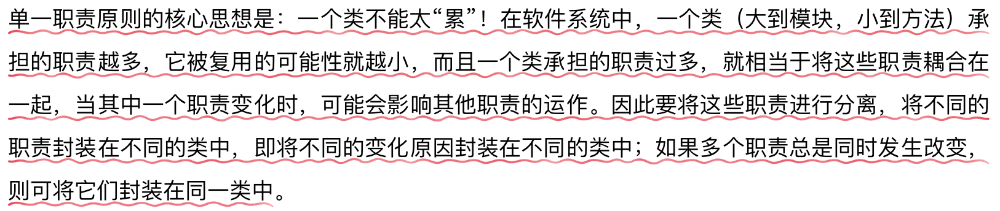

重构前，不满足单一职责原则：

- CustomerDataChart类承担了太多的职责，既包含与数据库相关的方法，又包含与图表生成和显示相关的方法

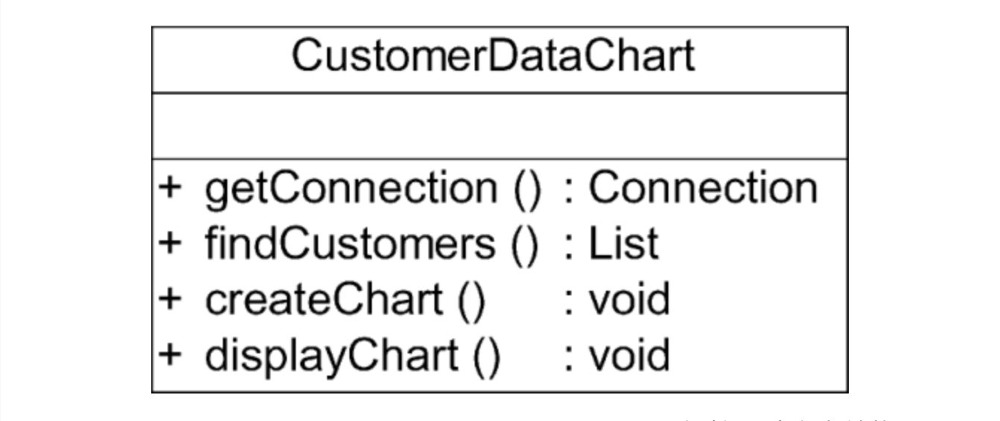

重构后，高内聚、低耦合：

- DBUtil：负责连接数据库，包含数据库连接方法getConnection()。
- CustomerDAO：负责操作数据库中的Customer表，包含对Customer表的增／删／改／查等方法，如findCustomers()。
- CustomerDataChart：负责图表的生成和显示，包含方法createChart()和displayChart()。

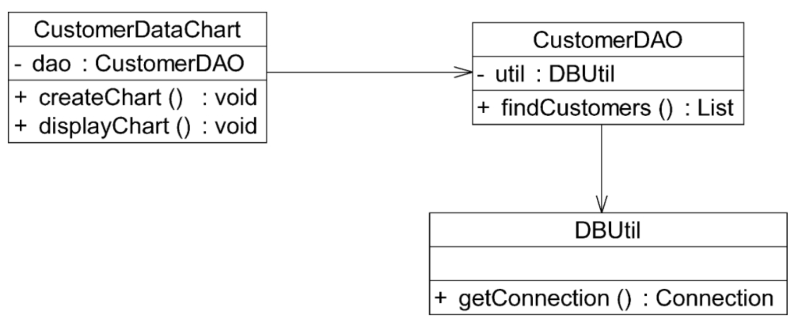

**（2）开闭原则（Open-Closed Principle，OCP）**

认为“软件应该是对于扩展开放的，但是对于修改封闭的” 的概念。

一个软件实体应当**对扩展开放，对修改关闭**。即软件实体应尽量**在不修改原有代码的情况下进行扩展**.

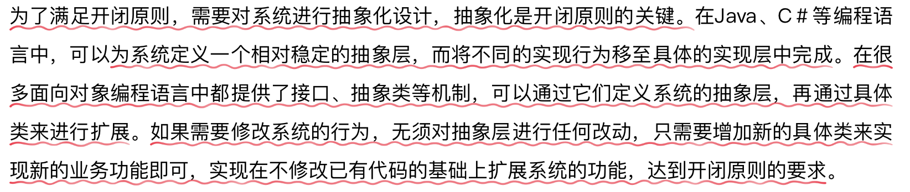

**（3）里氏代换原则（Liskov Substitution Principle，LSP）**

认为“程序中的对象应该是可以在不改变程序正确性的前提下被它的子类所替换的”的概念。

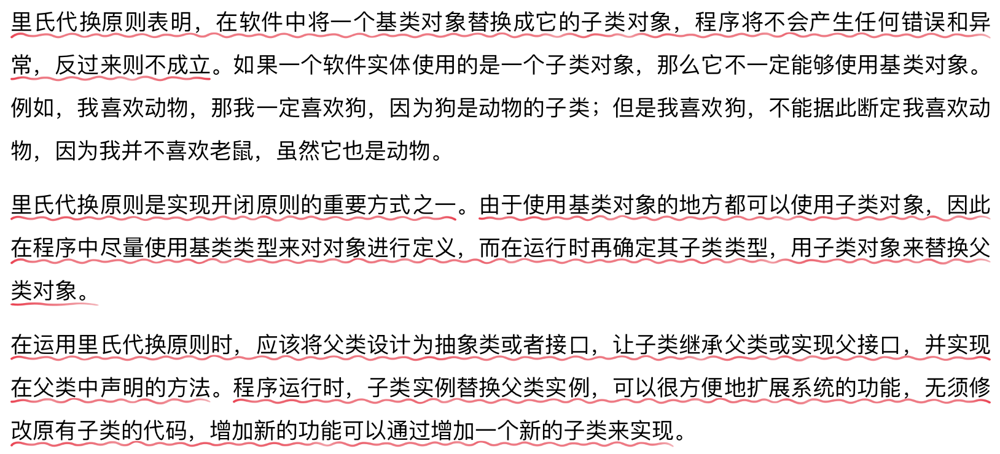

**（4）接口隔离原则（Interface Segregation Principle，ISP）**

认为“多个特定客户端接口要好于一个宽泛用途的接口”的 概念。

使用多个专门的接口，而不使用单一的总接口，即客户端不应该依赖那些它不需要的接口。

当一个接口太大时，需要将它分割成一些更细小的接口，使用该接口的客户端仅需知道与之相关的方法即可。每个接口应该承担一种相对独立的角色

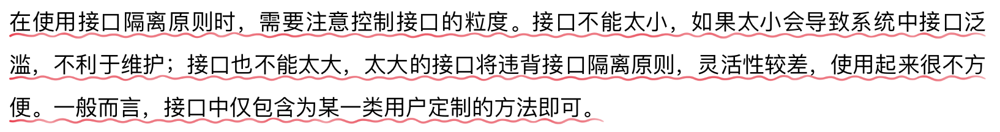

重构前，接口过大：

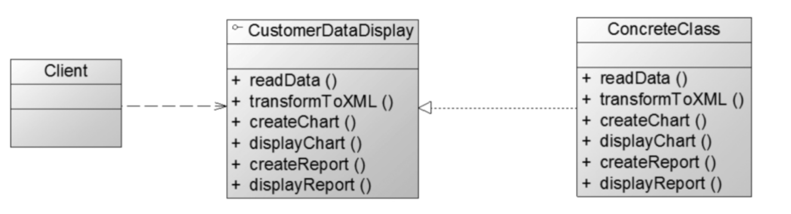

重构后：

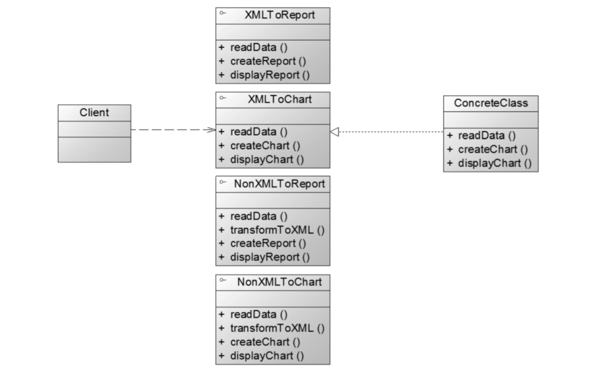

**（5）依赖倒转原则（Dependency Inversion Principle，DIP）**

认为一个方法应该遵从“依赖于抽象而不是一个实例”的概念， 依赖注入是该原则的一种实现方式。

抽象不应该依赖于细节，细节应该依赖于抽象。换言之，**要针对接口编程，而不是针对实现编程**。

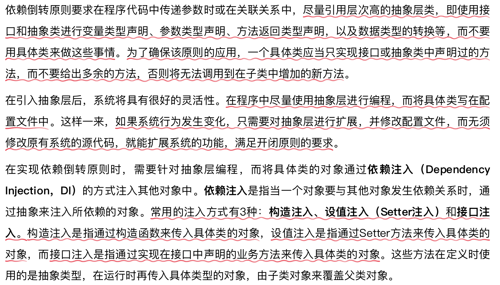

**开闭原则、里氏代换原则和依赖倒转原则使用案例：开闭原则是目标，里氏代换原则是基础，依赖倒转原则是手段**

数据格式转换案例，重构前：

- 增加新的数据转换类或者更换数据转换类时，都要修改CustomerDAO的源代码

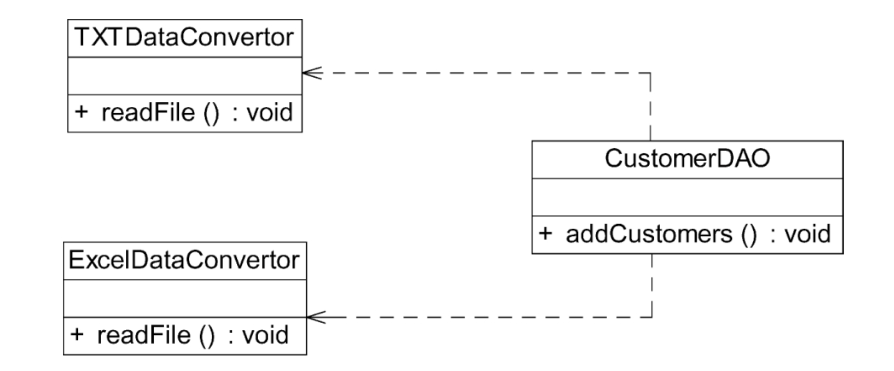

重构后：

- 依赖倒转原则：在引入抽象数据转换类DataConvertor之后，CustomerDAO针对抽象类DataConvertor编程，而将具体数据转换类的类名存储在配置文件中
- 里氏代换原则：程序运行时，具体数据转换类对象将替换DataConvertor类型的对象，程序不会产生任何异常
- 开闭原则：更换具体数据转换类时无须修改源代码，只需要修改配置文件；如果需要增加新的具体数据转换类，只要将新增数据转换类作为DataConvertor的子类并修改配置文件即可，原有代码无须做任何修改

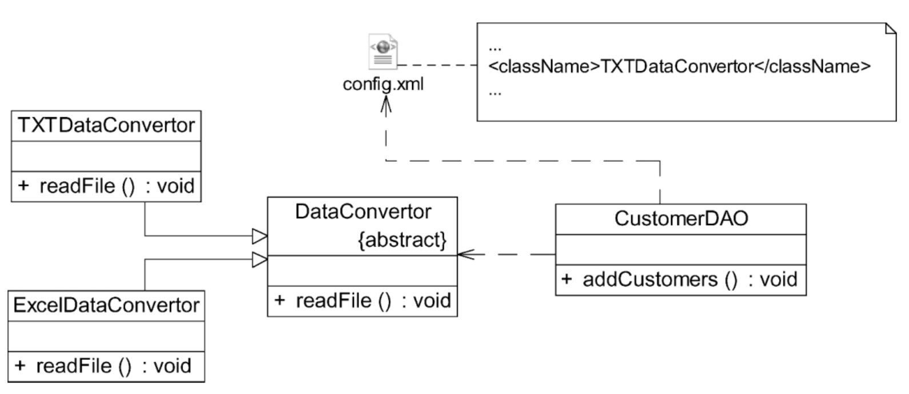

**（6）合成复用原则（Composite Reuse Principle，CRP）**

尽量使用对象组合，而不是继承来达到复用的目的。

复用时要**尽量使用组合／聚合关系（关联关系），少用继承**。

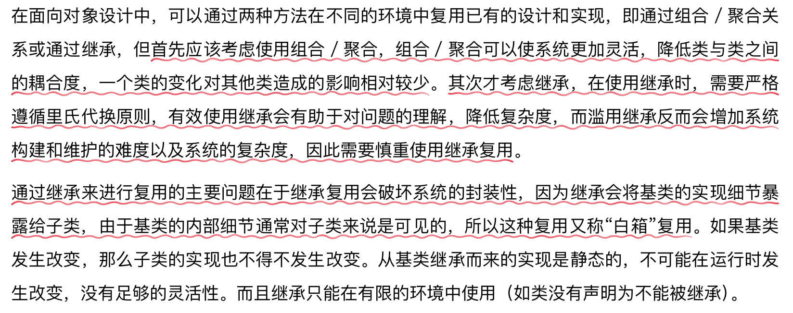

重构前：

- CustomerDAO和DBUtil之间是继承关系，因此在更换数据库连接方式时需要修改CustomerDAO类的源代码，将CustomerDAO作为OracleDBUtil的子类，这将违反开闭原则

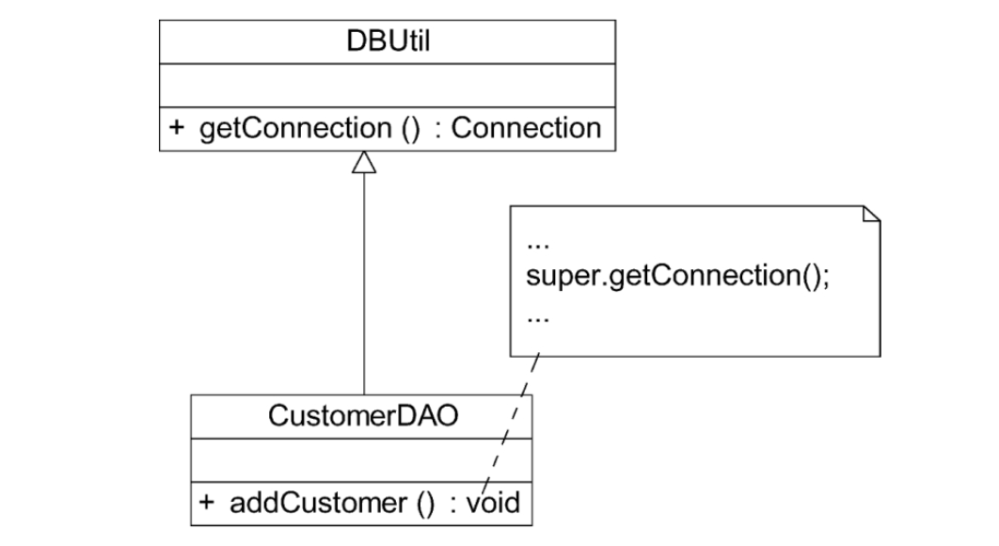

重构后：

- CustomerDAO和DBUtil之间的关系由继承关系变为关联关系，采用依赖注入的方式将DBUtil对象注入CustomerDAO中，可以使用构造注入，也可以使用设值注入
- 如果需要对DBUtil的功能进行扩展，可以通过其子类来实现，如通过子类OracleDBUtil来连接Oracle数据库。由于CustomerDAO针对DBUtil编程，根据里氏代换原则，DBUtil子类的对象可以覆盖DBUtil对象，只需在CustomerDAO中注入子类对象即可使用子类所扩展的方法

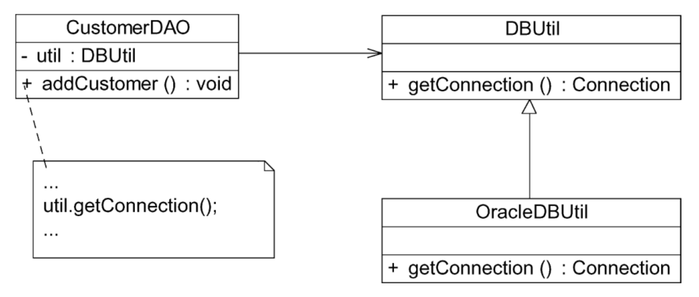

**（7）迪米特法则（Law of Demeter，LoD）**

一个软件实体应当尽可能少地与其他实体发生相互作用。

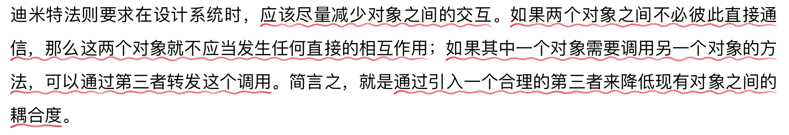

重构前：

- 界面控件之间的交互关系复杂，导致在该窗口中增加新的界面控件时需要修改与之交互的其他控件的源代码，系统扩展性较差，也不便于增加和删除控件

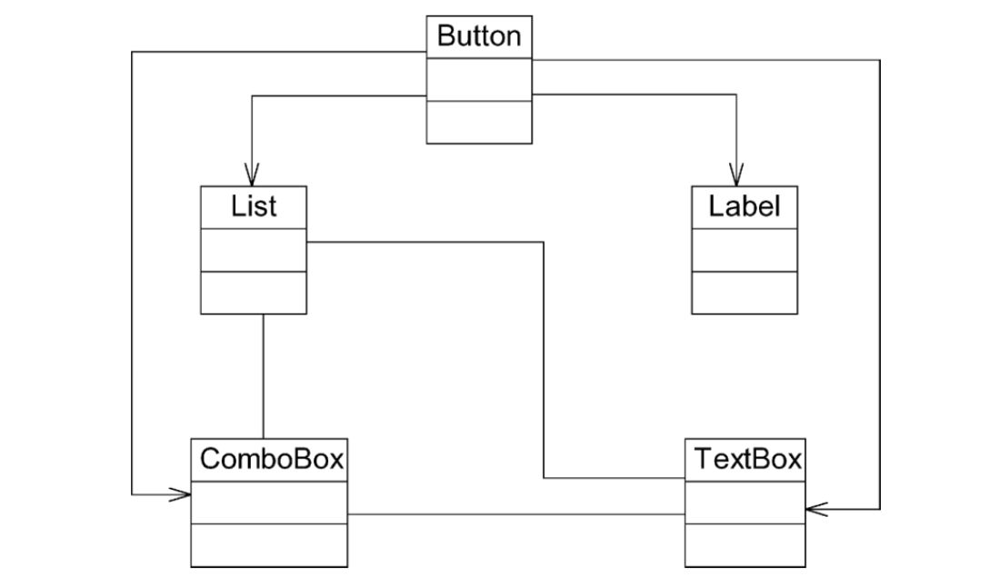

重构后：

- 通过引入一个专门用于控制界面控件交互的中间类（Mediator）来降低界面控件之间的耦合度
- 界面控件之间不再发生直接引用，而是将请求先转发给中间类，再由中间类来完成对其他控件的调用
- 当需要增加或删除新的控件时，只需修改中间类即可，无须修改新增控件或已有控件的源代码

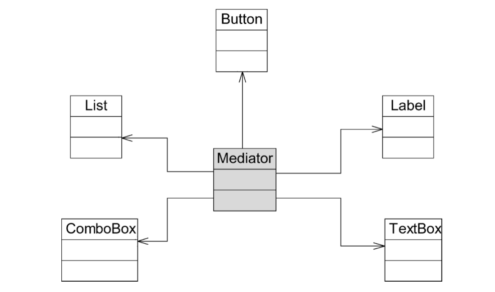

## 3 创建的艺术 —— 创建型模式

## 4 组合的艺术 —— 结构型模式

## 5 交互的艺术 —— 行为型模式

### 5.11 操作复杂对象结构 —— 访问者模式

提供一个作用于某对象结构中的各元素的操作表示，它使得可以在不改变各元素的类的前提下定义作用于这些元素的新操作。

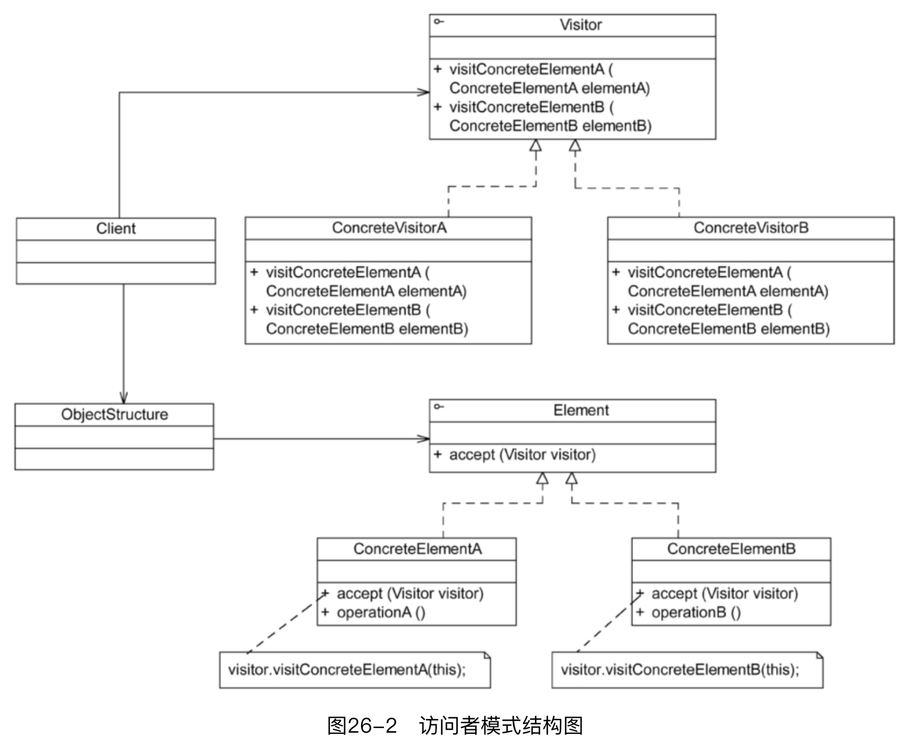

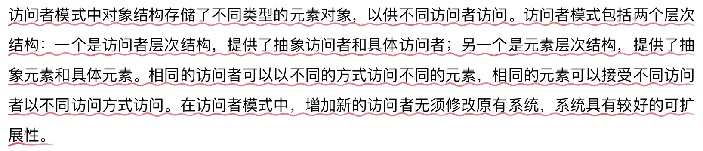

**双重分派机制代码实现：**

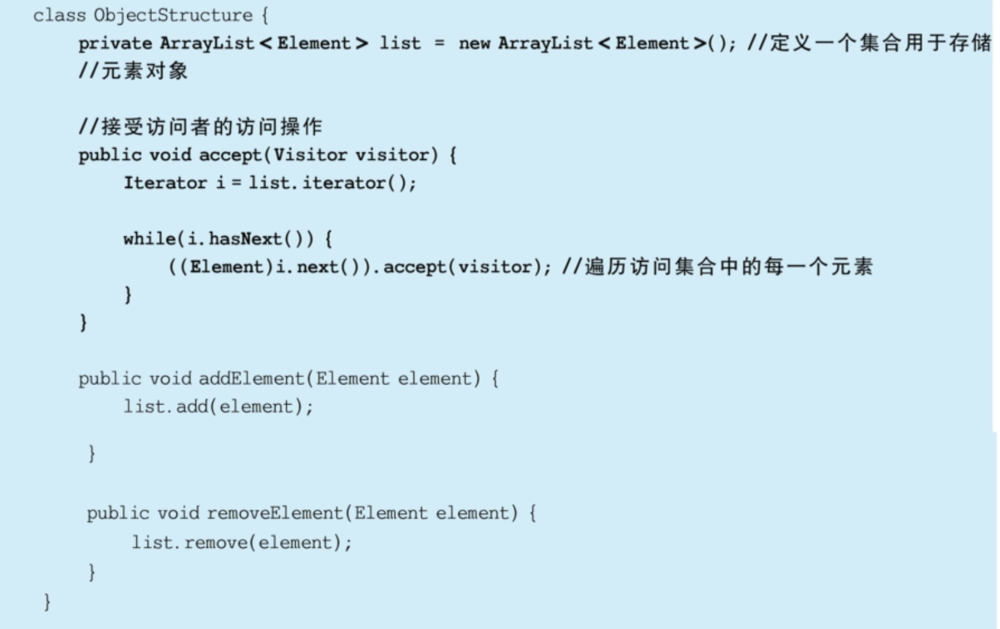

