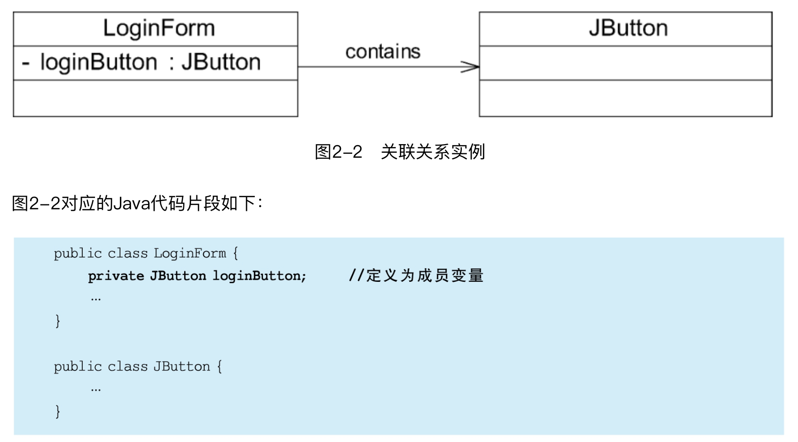

> 本文参考《设计模式的艺术》-- 刘伟

[TOC]

### 1 UML类图与面向对象设计原则

#### 1.1、UML特性

统一（Unified）、建模（Modeling）、语言（Language）

#### 1.2、类的UML图示

#### 1.3 类之间的关系

**（1）关联关系**

关联（Association）关系是是一种结构化关系，用于表示一类对象与另一类对象之间有联系，如汽车和轮胎、师傅和徒弟、班级和学生等。

**（2）聚合关系**

聚合（Aggregation）关系表示整体与部分的关系。在聚合关系中，成员对象是整体对象的一部分，但是成员对象可以脱离整体对象独立存在。

**（3）组合关系**

组合（Composition）关系也表示类之间整体和部分的关系，但是在组合关系中整体对象可以控制成员对象的生命周期。一旦整体对象不存在，成员对象也将不存在，成员对象与整体对象之间具有同生共死的关系。

**（4）依赖关系**

依赖（Dependency）关系是一种使用关系，特定事物的改变有可能会影响到使用该事物的其他事物，在需要表示一个事物使用另一个事物时使用依赖关系。大多数情况下，依赖关系体现在某个类的方法使用另一个类的对象作为参数。

**（5）泛化关系（继承关系）**

泛化（Generalization）关系也就是继承关系，用于描述父类与子类之间的关系，父类又称作基类或超类，子类又称作派生类。

**（6）接口与实现关系**

#### 1.4 面向对象的设计原则 （待整理）

面向对象设计原则也是用于评价一个设计模式的使用效果的重要指标之一，在之后的设计模式学习中，大家经常会看到诸如“×××模式符合×××原则”、“×××模式违反了×××原则”这样的语句。

### 1 创建型模式

### 2 结构性模式

### 3 行为型模式

#### 访问者模式

