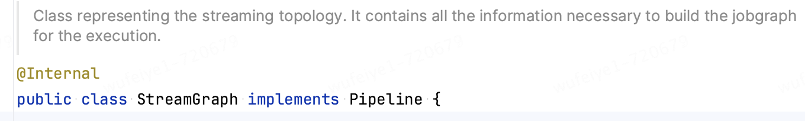
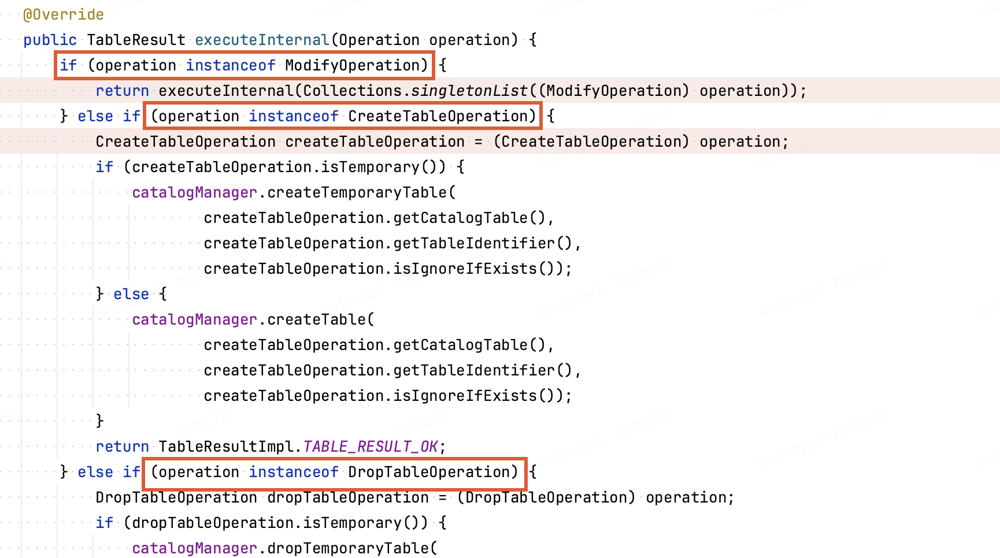
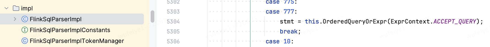
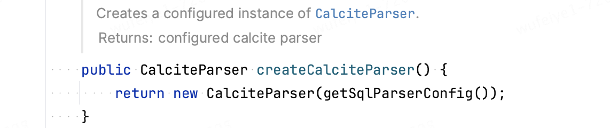
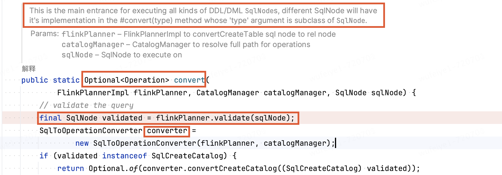

[TOC]

# 1 StreamTableEnvironment创建流程

~~~java
StreamExecutionEnvironment streamEnv = StreamExecutionEnvironment.getExecutionEnvironment();
// 入口
StreamTableEnvironment tableEnv = StreamTableEnvironment.create(streamEnv);
~~~


## 1.1 创建CatalogManager：管理元数据


## 1.2 创建Executor：transformations -> StreamGraph && execute


### 1.2.1 核心方法


#### 1 createPipeline：将transformations 转为 Pipeline(StreamGraph)


**createPipeline在DefaultExecutor中的具体实现：**




#### 2 execute、executeAsync：同步或异步触发执行Pipeline(StreamGraph)


## 1.3 创建Planner：SQL -> Operation  -> Transformation

**两大功能：**

- 通过getParser()方法获取SQL解析器，将SQL转换成Table API特定的Operation类型tree
- 优化、转化Operation类型tree为可执行的Transformation类型


### 1.3.1 核心方法

- getParser：获取SQL解析器
- translate：


### 1.3.2 创建流程

**由DefaultPlannerFactory的create方法创建，DefaultPlannerFactory对象是通过SPI机制创建的**


这里的PlannerFactory实现类为DefaultPlannerFactory：


DefaultPlannerFactory中的create方法，根据运行模式不同，可以创建StreamPlanner和BatchPlanner


# 2 Flink SQL是如何触发执行的

## 2.1 代码示例

~~~java
StreamExecutionEnvironment streamEnv = StreamExecutionEnvironment.getExecutionEnvironment();
streamEnv.setParallelism(1);
StreamTableEnvironment tableEnv = StreamTableEnvironment.create(streamEnv);

String createSourceTableSQL = "CREATE TABLE source_table ( " +
  "`id` INT, " +
  "`name` STRING," +
  " age INT ) WITH ( " +
  "    'connector' = 'datagen', " +
  "    'rows-per-second' = '1'" +
  ")";

String createSinkTableSQL = "CREATE TABLE print_table ( " +
  "`id` INT, " +
  "`name` STRING," +
  " age INT ) WITH ( " +
  "'connector' = 'print'" +
  ")";
tableEnv.executeSql(createSourceTableSQL);
tableEnv.executeSql(createSinkTableSQL);

tableEnv.executeSql("insert into print_table select id,name,age from source_table where id>100 and UPPER(name)='test'");
~~~

## 2.2 执行流程

**执行executeSql方法，会触发flink任务的执行，入口为TableEnvironmentImpl类。执行过程中会进行SQL解析 -> 校验 -> 转换 -> 优化 -> 代码生成 -> StreamGraph生成 -> 执行的各个步骤：**


**根据SQL的类型不同，有不同的执行方式：**

- ModifyOperation：INSERT INTO类型
- CreateTableOperation：CREATE TABLE类型
- DropTableOperation：DROP TABLE类型



这里以INSERT INTO类型举例：会将transfromations 转换成 StreamGrap，在触发执行


# 3 Flink SQL解析流程

> 参考：https://blog.csdn.net/hiliang521/article/details/134861469?spm=1001.2101.3001.6650.1&utm_medium=distribute.pc_relevant.none-task-blog-2%7Edefault%7EBlogCommendFromBaidu%7ERate-1-134861469-blog-132372907.235%5Ev43%5Epc_blog_bottom_relevance_base7&depth_1-utm_source=distribute.pc_relevant.none-task-blog-2%7Edefault%7EBlogCommendFromBaidu%7ERate-1-134861469-blog-132372907.235%5Ev43%5Epc_blog_bottom_relevance_base7&utm_relevant_index=2


## 3.1 SQL解析器的Java代码生成


**Flink源码中，涉及SQL解析器生成的目录如下：**


生成的SQL解析器类名为**org.apache.flink.sql.parser.impl.FlinkSqlParserImpl**，相关配置如下：


**FlinkSqlParserImpl的代码是通过JavaCC将Parser.jj转换生成的，对应关系举例如下：**

- **SqlParserImplFactory FACTORY**


- **SqlNode SqlStmt() 方法：将SQL语句解析成SqlNode**





## 3.2 SQL -> Operation


**获取Flink层面的解析器ParserImpl对象，用来将SQL -> Operation**

**流模式下的planner是StreamPlanner，调用StreamPlanner的getParser方法获取（这里的getParser方法实现在PlannerBase中）**


--->


--->


通过SPI机制扫描获取parserFactory，默认的实现类为DefaultParserFactory，


---> DefaultParserFactory.create：


**分别提供了validatorSupplier和calciteParserSupplier：**


- **validatorSupplier分析：后续会通过FlinkPlannerImpl.getOrCreateSqlValidator方法来创建validator**


- **calciteParserSupplier分析：创建了一个CalciteParser对象，CalcitePaser中会调用SqlParser.create创建Calcite生成的FlinkSqlParserImpl对象(.jj文件生成)，后续会通过FlinkSqlParserImpl将SQL转换为SQLNode**



---> 


--->


Parser创建完成：public class ParserImpl implements Parser，Parser核心方法如下：


 **Flink层面的解析器ParserImpl对象 -> parse流程**


### 3.2.1 SQL -> SqlNode AST（未校验）

```java
SqlNode parsed = parser.parse(statement);
```

**这里创建的parser是FlinkSqlParserImpl对象，FlinkSqlParserImpl同过.jj文件生成，通过parseStmt()方法将SQL转换成抽象语法树，这里返回的SqlNode为抽象语法树的根节点，此时并没有对抽象语法树的各个节点做校验。**


### 3.3.2 SqlNode -> Operation

```java
Operation operation =
        SqlToOperationConverter.convert(planner, catalogManager, parsed)
                .orElseThrow(() -> new TableException("Unsupported query: " + statement));
```



**（1）SqlNode -> validated SqlNode**

```java
final SqlNode validated = flinkPlanner.validate(sqlNode);
```


**补充：遍历SqlNode是通过访问者模式，调用SqlNode的accept方法，出入响应的SqlVisitor，对于SQL校验要传入validator**


SqlCall的accept实现：


**（2）根据不同的SqlNode类型，将validated SqlNode转换成不同的Operation**


## 3.3 Operation -> Transformation

### 3.3.1 转换：Operation -> RelNode


### 3.3.2 优化：RelNode -> RelNode

### 3.3.3 生成执行图execGraph：RelNode -> ExecNodeGraph

### 3.3.4 生成ransformations DAG：ExecNodeGraph -> Transformation

## 3.4 executeInternal

### 3.4.1 Transformation -> Pipeline（StreamGraph）

### 3.4.2 executeAsync pipeline

## 3.5


SPI机制的扫描文件

